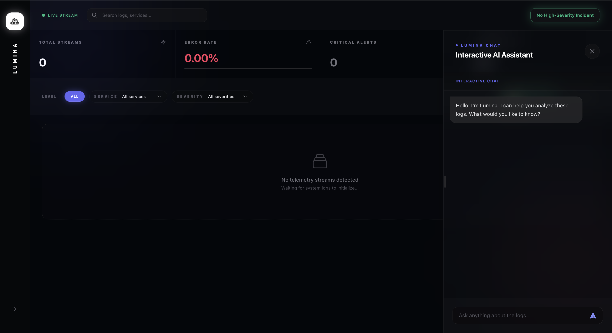
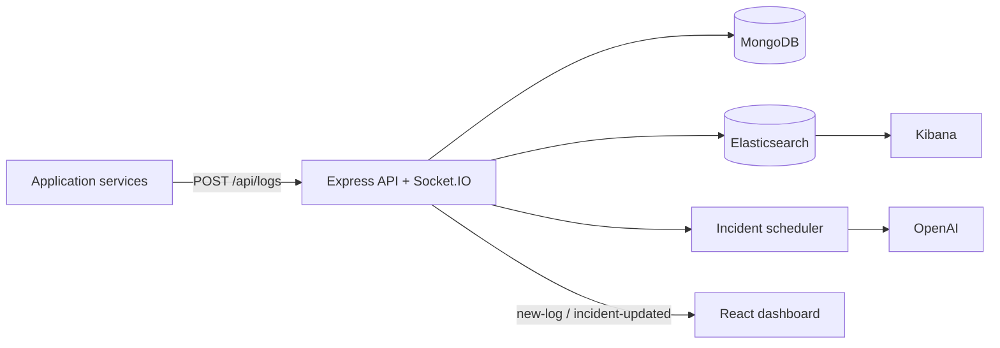

# Lumina: AI-Powered Observability Platform

Lumina is a full-stack observability project for ingesting, storing, searching, and investigating application logs with AI assistance. It combines a React dashboard, a Node.js and Express backend, MongoDB for durable log storage, Elasticsearch for search and aggregation, Socket.IO for live updates, and OpenAI-powered incident analysis and operator chat.

This repository also includes Docker, Kubernetes, and Helm deployment assets, plus Kibana for direct log exploration.



## Overview

The platform is designed around a simple idea: ship logs once, make them immediately visible everywhere, and use AI only where it actually helps operators move faster.

What Lumina does:

- Accepts structured log events over HTTP
- Stores every log in MongoDB
- Indexes logs into Elasticsearch for search and aggregations
- Broadcasts new events to the dashboard in real time over Socket.IO
- Creates incident records automatically for `high` severity logs
- Runs AI analysis over a 10-second incident window around the trigger event
- Offers an interactive AI chat that answers questions using recent log context
- Exposes Kibana alongside the app for deeper exploration

## Architecture



## Request and Incident Flow

1. A service sends a log to `POST /api/logs`.
2. The backend normalizes `level`, `severity`, `service`, and `message`.
3. The log is written to MongoDB.
4. The backend attempts to index the same event into Elasticsearch.
5. The new log is emitted to connected clients as `new-log`.
6. If `severity` is `high`, an incident document is created immediately.
7. The backend waits 5 seconds, gathers logs from `T-5s` to `T+5s`, and asks OpenAI for a concise diagnosis.
8. The incident is updated to `completed` or `failed` and emitted as `incident-updated`.
9. If a later log for the same service is `severity=low` or `level=info`, the latest active incident for that service is marked `resolved`.

## Key Features

- Real-time log ingestion through REST endpoints
- Dual-write log pipeline to MongoDB and Elasticsearch
- Live dashboard updates through Socket.IO
- Search and filter support by `level`, `severity`, `service`, and free-text query
- Dashboard metrics for total streams, error rate, critical alerts, and AI diagnostics state
- Automatic incident creation for `high` severity logs
- AI-generated root-cause style summaries for incident windows
- Interactive AI chat scoped to logs and troubleshooting
- Health and readiness probes for containerized deployment
- Raw Kubernetes manifests and a Helm chart for cluster deployment

## Tech Stack

| Layer | Technology |
| --- | --- |
| Frontend | React 19, Axios, Socket.IO Client, Tailwind-style utility classes |
| Backend | Node.js, Express 5, Socket.IO, Mongoose |
| Storage | MongoDB |
| Search and analytics | Elasticsearch 8 |
| AI | OpenAI API using `gpt-4o-mini` |
| Packaging and deploy | Docker, NGINX, Kubernetes, Helm |
| Exploration | Kibana |

## Repository Layout

```text
.
├── backend
│   ├── src
│   │   ├── app.js
│   │   ├── server.js
│   │   ├── config
│   │   ├── controllers
│   │   ├── models
│   │   ├── routes
│   │   └── services
│   ├── dockerfile
│   └── test-socket.js
├── frontend
│   ├── src
│   │   ├── components
│   │   └── assets
│   ├── dockerfile
│   └── nginx.conf
├── charts
│   └── lumina
├── k8s
├── docker-compose.yaml
└── README.md
```

## Backend API

| Method | Path | Purpose |
| --- | --- | --- |
| `POST` | `/api/logs` | Ingest a log, broadcast it over Socket.IO, and possibly create or resolve an incident |
| `GET` | `/api/logs` | Fetch paginated logs with optional filters |
| `GET` | `/api/logs/stats` | Return counts grouped by log level |
| `GET` | `/api/incidents` | Return recent incidents, optionally filtered by status |
| `GET` | `/api/logs/ai-analysis` | Analyze the 10 most recent Elasticsearch logs |
| `POST` | `/api/logs/ai-analysis` | Analyze an explicit `logs` array supplied in the request body |
| `POST` | `/api/logs/chat` | Chat with the AI assistant using recent logs as context |
| `GET` | `/health` | Liveness probe |
| `GET` | `/ready` | Readiness probe based on MongoDB connectivity |

### `POST /api/logs`

Expected payload:

```json
{
  "service": "payment-gateway",
  "level": "error",
  "severity": "high",
  "message": "Database connection pool exhausted"
}
```

Behavior:

- `service` and `message` are trimmed
- `level` is normalized to lowercase and defaults to `info`
- `severity` is normalized to lowercase and defaults to `medium`
- The response includes both the created `log` and the `incident` summary if one was created

### `GET /api/logs`

Supported query parameters:

- `page`
- `limit`
- `level`
- `service`
- `severity`
- `search`

Response shape:

```json
{
  "total": 42,
  "logs": []
}
```

### `GET /api/incidents`

Supported query parameters:

- `status`
- `limit`

Incident statuses used by the backend:

- `pending`
- `completed`
- `failed`
- `resolved`

### `POST /api/logs/chat`

Example request:

```json
{
  "messages": [
    {
      "role": "user",
      "content": "What is the likely root cause of the latest payment failures?"
    }
  ]
}
```

The assistant is intentionally restricted to log analysis and troubleshooting tasks.

## Frontend Experience

The dashboard in `frontend/` provides:

- A live log stream updated via Socket.IO
- Search across message, service, level, and severity
- Dynamic filter pills built from the log levels currently present
- Top-line metrics for total logs, error rate, high-severity alerts, and AI diagnostic state
- An incident drawer that shows trigger log, status, context count, and AI analysis
- An interactive chat tab for follow-up troubleshooting questions

## Environment Variables

The backend reads the following environment variables:

| Variable | Required | Default | Notes |
| --- | --- | --- | --- |
| `PORT` | No | `8000` | Backend HTTP port |
| `MONGO_URI` | Yes | None | Required for startup; also used by `/ready` |
| `OPENAI_API_KEY` | Required for AI features | None | Needed for incident analysis and chat endpoints |

### Important code-level assumptions

These are worth calling out because they affect local setup:

- Elasticsearch is currently hardcoded to `http://elasticsearch:9200` in `backend/src/config/elasticsearch.js`.
- The frontend calls relative paths such as `/api/logs` and `/socket.io`, so it expects a reverse proxy or ingress to keep everything on the same origin.
- `GET /api/logs/ai-analysis` relies on Elasticsearch when no explicit `logs` array is provided.

## Prerequisites

Depending on how you want to run the project, you may need:

- Node.js 22 or newer
- npm
- A reachable MongoDB instance
- Docker and Docker Compose
- A Kubernetes cluster with an ingress controller for the most complete browser experience

## Running the Project

There are several ways to run the repository. The most complete browser experience comes from using Kubernetes or Helm with ingress, because the frontend expects `/`, `/api`, `/socket.io`, and `/kibana` to be served from the same origin.

### Option 1: Kubernetes manifests

Create the backend secret first:

```bash
kubectl create secret generic backend-secrets \
  --from-literal=OPENAI_API_KEY="your-openai-api-key" \
  --from-literal=MONGO_URI="your-mongodb-connection-string"
```

Deploy everything in `k8s/`:

```bash
kubectl apply -f k8s/
```

What the raw manifests include:

- Backend deployment and service
- Frontend deployment and service
- Elasticsearch deployment and service
- Kibana deployment and service
- Ingress rules for `/`, `/api/`, `/socket.io/`, and `/kibana/`

Important note:

- The manifests do not provision MongoDB. `MONGO_URI` must point to an external or already-running MongoDB instance.

Useful ports from the raw manifests:

- Backend NodePort: `30007`
- Frontend NodePort: `30008`
- Kibana NodePort: `30001`

For the integrated UI, use ingress rather than direct NodePort access whenever possible.

### Option 2: Helm chart

The repository includes a Helm chart in `charts/lumina/`.

Create the secret expected by the chart:

```bash
kubectl create secret generic lumina-secrets \
  --from-literal=OPENAI_API_KEY="your-openai-api-key" \
  --from-literal=MONGO_URI="your-mongodb-connection-string"
```

Install or upgrade the release:

```bash
helm upgrade --install lumina ./charts/lumina
```

What the chart manages:

- Backend deployment and service
- Frontend deployment and service
- Elasticsearch deployment and service
- Kibana deployment and service
- Ingress routing

Chart notes:

- The backend service is exposed as NodePort by default
- The frontend and Kibana are designed to be accessed through ingress
- MongoDB is still external to this chart

### Option 3: Docker Compose

The Compose file is useful for backend-oriented development and quick infrastructure spin-up.

Before starting, create `backend/.env`:

```env
PORT=8000
MONGO_URI=your-mongodb-connection-string
OPENAI_API_KEY=your-openai-api-key
```

Start the stack:

```bash
docker compose up --build
```

This launches:

- `backend`
- `elasticsearch`
- `kibana`

Exposed ports:

- Backend: `http://localhost:8001`
- Elasticsearch: `http://localhost:9200`
- Kibana: `http://localhost:5601`

Compose caveats:

- MongoDB is not included, so `MONGO_URI` must point to an existing database
- The frontend is not included in `docker-compose.yaml`

### Option 4: Local npm development

#### Backend

```bash
cd backend
npm install
npm run dev
```

For this to work cleanly, you need:

- A working `backend/.env`
- MongoDB available through `MONGO_URI`
- Elasticsearch reachable at `http://elasticsearch:9200`

If Elasticsearch is running somewhere else locally, you will need to update `backend/src/config/elasticsearch.js` or provide a local hostname alias named `elasticsearch`.

#### Frontend

```bash
cd frontend
npm install
npm start
```

Important note about local frontend development:

- The frontend dev server does not currently define a proxy target in `frontend/package.json`.
- Because the UI uses relative `/api` and `/socket.io` URLs, `npm start` alone is not enough for a full end-to-end browser experience unless you add your own proxy or run through a reverse proxy.

If you mainly want to test ingestion and backend behavior, use the API examples below plus `backend/test-socket.js`.

## Quick Smoke Tests

Choose a base URL first:

- Raw Kubernetes backend NodePort: `http://localhost:30007`
- Docker Compose backend: `http://localhost:8001`

Example:

```bash
BASE_URL=http://localhost:30007
```

### Send a high-severity log

```bash
curl -X POST "$BASE_URL/api/logs" \
  -H "Content-Type: application/json" \
  -d '{
    "service": "payment-gateway",
    "level": "error",
    "severity": "high",
    "message": "CRITICAL: Database connection pool exhausted - failing all incoming transactions"
  }'
```

### Send a recovery log for the same service

```bash
curl -X POST "$BASE_URL/api/logs" \
  -H "Content-Type: application/json" \
  -d '{
    "service": "payment-gateway",
    "level": "info",
    "severity": "low",
    "message": "RECOVERY: Database connection re-established - connection pool stabilized"
  }'
```

### Read recent incidents

```bash
curl "$BASE_URL/api/incidents?limit=5"
```

### Watch live Socket.IO events

```bash
cd backend
node test-socket.js
```

`backend/test-socket.js` currently points to `http://localhost:30007`, so if you are using Docker Compose you should update that URL to `http://localhost:8001` before running it.

## Health and Readiness

The backend exposes two operational endpoints:

- `/health` returns a basic liveness response
- `/ready` checks MongoDB availability and returns `503` if MongoDB is not ready

The current readiness endpoint does not verify Elasticsearch or OpenAI availability.

## Deployment Assets Included

| Path | Purpose |
| --- | --- |
| `docker-compose.yaml` | Starts backend, Elasticsearch, and Kibana |
| `k8s/` | Raw Kubernetes manifests for the application stack |
| `charts/lumina/` | Helm chart for the stack |
| `frontend/nginx.conf` | NGINX config for serving the React build and defining same-origin API and Socket.IO proxy routes |
| `backend/test-socket.js` | Small client for testing real-time events |
| `curl commands` | Example ingestion requests |

## Operational Notes and Current Limitations

- MongoDB is the system of record. Logs are always written there first.
- If Elasticsearch indexing fails during log creation, the backend keeps the MongoDB write and continues.
- If Elasticsearch search or aggregation fails, `GET /api/logs` and `GET /api/logs/stats` fall back to MongoDB-based queries.
- Incident analysis is asynchronous and intentionally delayed by 5 seconds to collect post-trigger context.
- The AI chat endpoint pulls the latest logs through the shared log service, so it can fall back to MongoDB-backed retrieval if Elasticsearch queries fail.
- The repository does not currently provision MongoDB in Docker Compose, raw manifests, or the Helm chart.
- Local browser development is not fully plug-and-play yet because the frontend expects same-origin proxying for `/api` and `/socket.io`.

## Suggested Next Improvements

If you want to evolve the project further, the most valuable upgrades would be:

- Make the Elasticsearch endpoint configurable through environment variables
- Add a frontend development proxy for `npm start`
- Include MongoDB in the local infrastructure story or provide a dedicated dev manifest
- Add authentication and authorization for the dashboard and API
- Add automated backend tests around ingestion, fallbacks, and incident lifecycle behavior

## Summary

Lumina already covers the core observability loop well: ingest logs, stream them live, search them quickly, detect high-severity events, and get AI-assisted diagnostics without leaving the platform. The repository is especially strong as a portfolio-ready full-stack project because it shows application code, real-time updates, search infrastructure, AI integration, and deployment assets in one place.
